# Frontend Architecture & Decisions

## Overview
This document outlines the initial frontend architecture, technology choices, and design decisions for the battery monitoring mobile application.  
The app connects to battery hardware via an ESP32 controller, displays live battery metrics, and syncs data with a backend service.

This document is intended to serve as a living reference and will evolve as implementation progresses.

---

## Goals
- Display real-time battery metrics (voltage, charge cycles, health, etc.)
- Authenticate users securely
- Maintain a scalable and maintainable frontend architecture

---

## Technology Stack

### Mobile Framework
- **React Native & Expo (SDK 55)**
  - Cross-platform support (iOS & Android)
  - File-based navigation via **Expo Router**

### Core Services
- **Data Persistence & Offline Syncing**: `expo-sqlite` (Local queues for fault-tolerant batch sync)
- **Bluetooth/IoT Communication**: `react-native-ble-plx`
- **Firmware Uploads (OTA)**: `expo-file-system` and `buffer` for transferring `.bin` binaries over BLE.
- **Authentication**: **Firebase Authentication** (Google Sign-In via `@react-native-google-signin` and Email/Password).

---

## 📁 Directory Map

```text
root/
├── app/                  # ROUTING: Every file here is a route
│   ├── (auth)/           # Logged-out flow (Login)
│   ├── _layout.tsx       # Root layout (Theme injection, Auth Guards)
│   ├── (tabs)/           # Authenticated user flow (Dashboard, Settings)
│   └── asyncStorage/...  # Testing & debug routes
├── components/           # Reusable UI (Cards, StatTiles, Thermometer, Alerts)
├── context/              # Global state (BLEContext, AuthContext, SettingsContext)
├── services/             # API calls (batteryApi.js, authService.js)
├── constants/            # Colors.js, Spacing, Keys
└── utils/                # Helper Functions
```

### Component Hierarchy



## Navigation Strategy

- Navigation is implemented using **Expo Router** (File-based routing).
- `<AuthLayout>` guards protect the `(tabs)` group so users cannot bypass login.

### Primary User Flow
1. **Authentication:** (`app/(auth)/login.js`) handled via Firebase Google/Email provider.
2. **Dashboard / Bluetooth Connection:** (`app/(tabs)/dashboard.jsx`).
   - If no sensor is connected, it embeds `BluetoothConnectionUI.js` to scan and pair an ESP32.
   - If connected, it displays real-time telemetry (Voltage, Temperature, SOC, Amps).
3. **Settings & Maintenance:** (`app/(tabs)/settings.jsx`).
   - Controls metric toggles (Celsius/Fahrenheit), polling intervals.
   - Initiates OTA (`Over-the-Air`) updates by writing local binaries to the module over BLE characteristics.

---
## High-Level Data Flow

```markdown
Battery Hardware (ESP32)
         ↓  (Bluetooth BLE - GATT Server)
React Native Mobile App
         |-- Live Dashboard Render
         |-- Validation & Altering Engine (TelemetryAlertBanner)
         ↓  (expo-sqlite Local Queue)
Background Sync Worker
         ↓  (Idempotent REST APIs + ACK)
Node.js / PostgreSQL Backend API
```

### Key Subsystems:
1. **Real-time Pipeline:** ESP32 drops payload notifications; React Native deserializes the raw Hex buffer and writes it into global `BLEContext`.
2. **Offline-First Synchronization:** When internet falls, telemetry metrics are immediately written to local `expo-sqlite` databases. When connection restores, chunks are reliably synced to the backend to ensure zero data loss.
3. **Dynamic Alerting:** Values are passed through validation metrics (e.g. Temperature > 45°C). Critical/Warning banners are generated dynamically via `TelemetryAlertBanner.js`.

---

## Theming & UI

- Implemented **system-aware adaptive theming** using React Native's `useColorScheme()` hooking securely into constants.
- The UI features a premium aesthetic featuring dynamic SVG mercury thermometers, battery visualization, pill-buttons, and responsive component sizing.

## Error, Loading & Empty States
- Global handling for:
  - API failures and network drops via Local SQLite queues.
  - Authentication fallback flows.
  - BLE state handling (`isScanning`, `isConnecting`, `connectedDevice`).
- Consistent loading indicators across screens (via `ActivityIndicator` integrated into buttons).
- Custom localized telemetry alerts for hardware safety bounds (Overvoltage, UnderTemperature, Load Shorts).